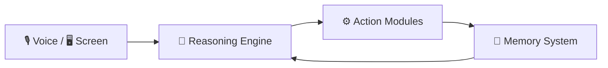

<h1 align="center">🤖 Sypher</h1>
<h3 align="center">AI System Controller for Windows</h3>

<p align="center">
  <b>From conversation → to execution</b><br>
  A multi-modal AI agent that <i>sees, hears, thinks, and acts</i>.
</p>

<p align="center">
  
  
  
  
  
</p>

---

# ⚡ What is Sypher?

**Sypher** is a next-generation AI agent that bridges Large Language Models with **real system execution**.

Unlike traditional assistants, Sypher operates as an **autonomous system controller** capable of:

* Understanding context
* Making decisions
* Executing real-world tasks on your machine

> It doesn’t just respond — it **acts**.

---

# 🧠 Core Experience



---

# 🔥 Key Features

## 🎙️ Multi-Modal Interaction

* Voice + text hybrid interface
* Natural language → real execution
* Low-latency responses

## 👁️ Vision Awareness

* OCR-based screen understanding
* Context extraction from active windows
* Optional webcam perception

## ⚙️ System Control

* Launch apps and execute shell commands
* Control system volume, brightness, and settings
* Automate workflows

## 📂 File Automation

* Create, move, delete, and organize files
* Context-aware file operations

## 🌐 Web Intelligence

* Google Search integration
* Live weather updates
* YouTube playback control

## 🧠 Persistent Memory

* Learns user behavior
* Stores preferences and history
* Improves over time

## 🔐 Safety System

* Sensitive actions require approval
* Prevents unintended operations

---

# 🏗️ Architecture

```text
Perception → Reasoning → Execution → Memory → (Loop)
```

---

# ⚙️ Installation

## 1️⃣ Clone Repository

```bash
git clone https://github.com/amwanshul/Sypher.git
cd Sypher
```

## 2️⃣ Create Virtual Environment

```bash
python -m venv venv
.\venv\Scripts\activate
```

## 3️⃣ Install Dependencies

```bash
pip install -r requirements.txt
```

---

# 🔐 API Configuration

Sypher uses a configuration file to manage API keys.

### 📁 Location

```bash
config/api_keys.json
```

### 🧾 Add Your API Key

```json
{
  "GEMINI_API_KEY": "your_api_key_here"
}
```

### 🌐 Get Your API Key

https://aistudio.google.com/

---

⚠️ **Security Note**

* Do NOT commit `api_keys.json`
* Add it to `.gitignore`

```bash
config/api_keys.json
```

---

# ▶️ Run Sypher

### ⚙️ One-Time Setup

```bash
python setup.py
```

> ⚠️ Run this **only once** during initial setup.
> It prepares required configurations and environment.

---

### 🚀 Start Application

```bash
python main.py
```

---

# 📁 Project Structure

```text
Sypher/
│
├── actions/        # System action modules (browser, cmd, desktop, etc.)
├── agent/          # Agent orchestration logic (planner, executor, queue)
├── config/         # Configuration and safety settings
├── core/           # Core prompts and reasoning logic
├── memory/         # Persistent memory and config management
├── security/       # Approval and safety layer
├── tests/          # Comprehensive unit and integration tests
├── tools/          # Utility tools and schema registration
│
├── main.py         # Application entry point
├── setup.py        # Environment setup script
├── ui.py           # User interface logic
└── requirements.txt # Project dependencies
```

---

# 🧩 Example Workflow

> “Open Chrome, search for AI tools, and save results.”

Sypher will:

1. Understand the command
2. Break it into steps
3. Execute system actions
4. Store context for future use

---

# ⚠️ Limitations

* Windows-only (uses system-level APIs)
* Requires internet (Gemini API)
* Performance depends on hardware

---

# 🔮 Roadmap

* Cross-platform support (Linux/macOS)
* Plugin system for custom actions
* Local/offline LLM integration
* Advanced task planning
* Monitoring dashboard

---

# 🤝 Contributing

Contributions are welcome! To maintain a clean and organized history, this project follows **Conventional Commits** standards.

## 📜 Commit Standards

All commit messages and Pull Request titles must use one of the following prefixes:

| Prefix | When to use it | Example |
| :--- | :--- | :--- |
| `feat:` | You added a **new feature** to the code. | `feat: add camera processing logic` |
| `fix:` | You fixed a **bug or error**. | `fix: resolve crash on app startup` |
| `docs:` | You only changed the **documentation** (like README). | `docs: update installation steps` |
| `style:` | Changes that **don't affect logic** (formatting, semi-colons). | `style: reformat main.py with black` |
| `refactor:` | **Rewriting code** to be better, but no new features/fixes. | `refactor: simplify database connection` |
| `chore:` | **Routine tasks** (updating dependencies, .gitignore). | `chore: add api_keys to gitignore` |
| `test:` | Adding or fixing **tests**. | `test: add unit tests for login logic` |

---

# 📜 License

Licensed under **CC BY-NC 4.0**

---

<p align="center">
⭐ Star the repo if this project impressed you
</p>

<p align="center">
Built for execution. Designed for the future.
</p>
